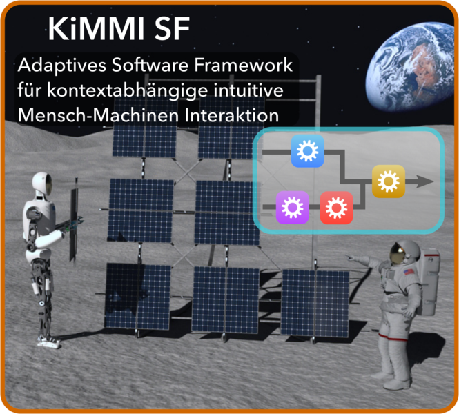

# Robot Dance Generation with Music Based Trajectory Optimization


This repo contains the model data of RH5 Manus robot used as a case study in the paper [Robot Dance Generation with Music Based Trajectory Optimization](https://dfki-ric-underactuated-lab.github.io/robot_dance_generation/). The paper was accepted at the [IROS 2022 Conference](https://iros2022.org/). A preprint is available on [Researchgate](https://www.researchgate.net/publication/362133955_Robot_Dance_Generation_with_Music_Based_Trajectory_Optimization).

### Citation

M. Boukheddimi et al., "Robot Dance Generation with Music Based Trajectory Optimization," 2022 IEEE/RSJ International Conference on Intelligent Robots and Systems (IROS), Kyoto, Japan, 2022, pp. 3069-3076, doi: 10.1109/IROS47612.2022.9981462.
```
  @INPROCEEDINGS{9981462,
  author={Boukheddimi, Melya and Harnack, Daniel and Kumar, Shivesh and Kumar, Rohit and Vyas, Shubham and Arriaga, Octavio and Kirchner, Frank},
  booktitle={2022 IEEE/RSJ International Conference on Intelligent Robots and Systems (IROS)}, 
  title={Robot Dance Generation with Music Based Trajectory Optimization}, 
  year={2022},
  volume={},
  number={},
  pages={3069-3076},
  doi={10.1109/IROS47612.2022.9981462}}
```

</div>
<div align="center">
  
  
  
  
  
    
</div>

