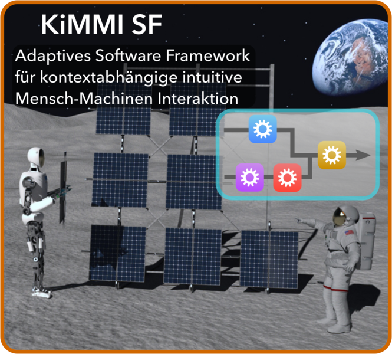

# robot_dance_generation
Robot Dance Generation with Music Based Trajectory Optimization

# Robot Dance Generation with Music Based Trajectory Optimization

This repo contains the model data of RH5 Manus robot used as a case study in the paper [Robot Dance Generation with Music Based Trajectory Optimization](https://dfki-ric-underactuated-lab.github.io/robot_dance_generation/). The paper was accepted at the [IROS 2022 Conference](https://iros2022.org/). A preprint is available on [Researchgate](https://www.researchgate.net/publication/362133955_Robot_Dance_Generation_with_Music_Based_Trajectory_Optimization).

### Citation

elya Boukheddimi*, Daniel Harnack*, Shivesh Kumar,;
Rohit Kumar, Shubham Vyas, Octavio Arriaga and Frank Kirchner.
(IEEE-IROS 2022). Robot Dance Generation with Music Based Trajectory Optimization.

    @misc{Dance22,
          author = {Melya Boukheddimi*, Daniel Harnack*, Shivesh Kumar,
          Rohit Kumar, Shubham Vyas, Octavio Arriaga and Frank Kirchner}, year =
          {2022}, month = {07}, journal = {IEEE-IROS 2022}, title = {Robot Dance
          Generation with Music Based Trajectory Optimization}

  
  
  
  
  
    

