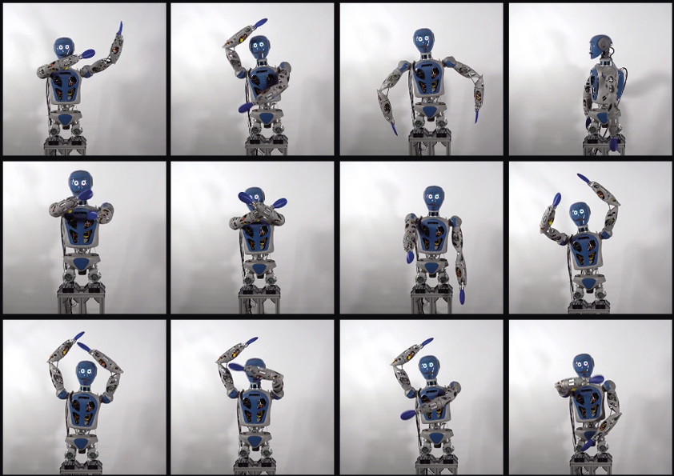
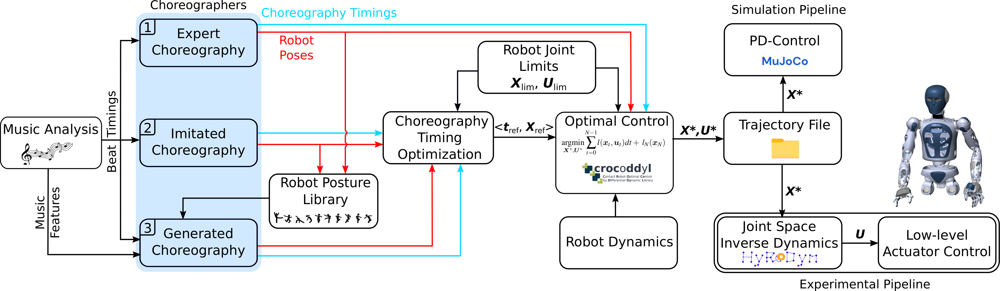

Musical dancing is an ubiquitous phenomenon in the human society. Providing robots the ability to dance has the potential to make the human robot co-existence more acceptable in our society. Hence, dancing robots have generated a considerable research interest in the recent years. In this paper, we present a novel formalization of robot dancing as planning and control of optimally timed actions based on beat timings and additional features extracted from the music. We showcase the use of this formulation in three different variations: with input of human expert choreography, imitation of a predefined choreography, and automated generation of a novel choreography. Our method has been validated on four different musical pieces, both in simulation and on a real robot, using the upper-body humanoid robot RH5 Manus.

{style="display: block; margin: auto; padding: 20px;" }

## Introduction
Human-robot interactions are increasingly prevalent in var- ious fields of modern robotics. Humanoid robots are specif- ically suited in these applications, since they are designed to perform anthropomorphic movements which resemble human behavior. The ability of a robot to mimic a human being is not only beneficial for ergonomics of the shared spaces, but also for emotional reasons. An anthropomorphic posture of the robot can elicit a sense of trust or comfort in an interacting human, with potential emotional engage- ment. Dancing is especially interesting in this context, since it is deeply rooted in human society as a behavior that supports social interaction.

## Contribution
In this work, we propose a generic formalization of dance which allows us to use musical features for choreography generation. Optimal dance trajectories were computed by direct optimal control. From this formalization we derive three different methods of dance generation, that differ in the level of flexibility, human involvement, and automatization. The methods are: imitated, improvised, and automatic choreography generation. We consider choreographies tailored to a specific system by a robotics expert, imitation of choreographies performed by human dancers, and automatically generated choreographies. The expert and imitated choreography methods are based on beat timing extraction. The automatic choreography generation method uses the additional music features volume and vocal melody. The results are validated on 4 different music pieces in simulation, using the dynamic simulator MuJoCo, as well as in experiments on the real robot RH5 Manus. 

## Methodology
The overall pipeline for dance generation is visualized in the following figure. The first step is analyzing a given digital music signal, which provides the beat timings T_b and potentially additional music features g(m) to the choreography specification step. The purpose of this step is the generation of the robot choreography for which we implemented 3 different methods:
1) designing a choreography by a robotics expert for a specific target system,
2) imitating an existing human choreography under supervision,
3) generating a novel choreography automatically from additional harmonic features.
In the choreography timing optimization, the optimal control problem is solved to generate timings based on constraints of the target robot. In the optimal control block, the transitions between postures are filled in, and the optimal dance trajectory is generated, which subsequently can be used in simulation as well as be deployed on the real robot.

{style="display: block; margin: auto; padding: 20px;" }

## Experimental Results
The two accompanying videos show the results of the beat extraction and music analysis, as well as dance performances in simulation and on the real robot.Video 1,Video 2.

The figure below shows a snapshot of the video for the expert choreography method (Tunak Tunak Tun dance), including the human choreographer, the simulation, and the real robot. 

{style="display: block; margin: auto; padding: 20px;" }

The complete details can be found in the paper.

## Conclusion
This paper presented a mathematical formalization of musical dance and derived a methodology for robot dance generation based on music analysis and optimal control. In accordance with other approaches, the foundation is the extraction of beat timings. This is followed by choreography generation, for which we identified and implemented three different methods, each with a different level of human interaction as well as human flexibility in dance creation for a robot. These methods were validated by successful generation of four different dynamic dances, both realized in simulation and on a real robot, the RH5-Manus system. is contribution, we addressed several problems in the state of the art in robot dance generation. On a conceptual level, the underlying formalization of choreography and dance as a multi level optimization problem is the first of this kind to our knowledge. The formulation is general and can thus be applied to humanoid and non-humanoid robots alike, such as quadrupeds or even quadrotors. 

## Citation

Melya Boukheddimi* & Daniel Harnack* & Shivesh Kumar & Rohit Kumar & Shubham Vyas
& Octavio Arriaga and Frank Kirchner. (IEEE-IROS 2022). Robot Dance Generation with Music Based Trajectory Optimization.

    @misc{Dance22,
  author = {Melya Boukheddimi*, Daniel Harnack*, Shivesh Kumar,  Rohit Kumar, Shubham Vyas, Octavio Arriaga and Frank Kirchner},
  year = {2022},
  month = {07},
  journal = {IEEE-IROS 2022},
  title = {Robot Dance Generation with Music Based Trajectory Optimization},
}

